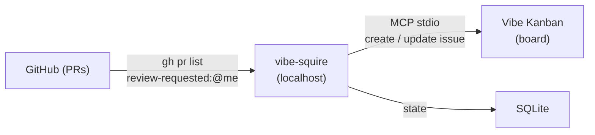

# vibe-squire

Local background orchestrator that polls **GitHub** for PRs requesting your review and syncs them as issues into **[Vibe Kanban](https://vibekanban.com)** over MCP (Model Context Protocol).

Built with [NestJS](https://nestjs.com), [Prisma](https://www.prisma.io) + SQLite, and a hexagonal architecture that keeps source/destination adapters pluggable.

## How it works



1. **Scout** — polls GitHub via `gh pr list --search "review-requested:@me"` on a configurable interval.
2. **Dispatcher** — routes each PR to a Kanban project based on `owner/repo` mappings, deduplicates, and creates/updates issues via the Vibe Kanban MCP server.
3. **Reconciliation** — when a PR leaves your review queue, the matching Kanban issue is closed automatically.

## Prerequisites

- **Node.js** >= 20 (LTS)
- **[`gh`](https://cli.github.com/)** — installed and authenticated (`gh auth login`)
- **[Vibe Kanban](https://vibekanban.com)** — the MCP server is spawned automatically as a stdio subprocess (`npx vibe-kanban@latest --mcp`)

## Quick start

```bash
git clone https://github.com/AliakseiPialetski/vibe-squire.git
cd vibe-squire
npm install
cp .env.example .env          # review and adjust settings
npm run start:dev              # dev mode with watch
```

Open the operator UI at **http://127.0.0.1:3000/ui/dashboard** (root `/` redirects there).

## Configuration

### Environment variables

| Variable | Default | Description |
|----------|---------|-------------|
| `DATABASE_URL` | `file:./dev.db` | SQLite URL for Prisma. If unset, resolved from `DATABASE_PATH`, `VIBE_SQUIRE_DATA_DIR`, or OS defaults. |
| `HOST` | `127.0.0.1` | HTTP bind address. |
| `PORT` | `3000` | HTTP bind port. |
| `SOURCE_TYPE` | `github` | Scout adapter (`github`). |
| `DESTINATION_TYPE` | `vibe_kanban` | Board adapter (`vibe_kanban`). |
| `SCHEDULED_SYNC_ENABLED` | `true` | Set `false` to disable the automatic poll timer (manual "Sync now" still works). |
| `POLL_INTERVAL_MINUTES` | `10` | Minutes between scheduled polls (minimum 5, clamped). |
| `JITTER_MAX_SECONDS` | `30` | Random jitter added to the poll interval. |
| `RUN_NOW_COOLDOWN_SECONDS` | `60` | Minimum gap after a manual sync before another is allowed. |
| `LOG_LEVEL` | `info` | Pino log level (`fatal` / `error` / `warn` / `info` / `debug` / `trace` / `silent`). |
| `LOG_FILE_PATH` | — | Path for JSON file logging (in addition to console). |
| `OPENAPI_ENABLED` | `true` | Expose Swagger UI at `/api/docs`. |

### Runtime settings (SQLite)

These have no env var equivalent — set them via the operator UI or `PATCH /api/settings`:

`default_organization_id`, `default_project_id`, `vk_workspace_executor`, `kanban_done_status`, `pr_ignore_author_logins`, `pr_review_body_template`, `max_board_pr_count`.

### Effective precedence

For keys that have both an env var and a SQLite row: **env (non-empty) > SQLite > code default**.

### Database location

When `DATABASE_URL` is not set, the app resolves a path automatically:

| OS | Default directory |
|----|-------------------|
| Linux | `~/.local/state/vibe-squire/` (respects `XDG_STATE_HOME`) |
| macOS | `~/Library/Application Support/vibe-squire/` |
| Windows | `%APPDATA%\vibe-squire\` |

Override with `VIBE_SQUIRE_DATA_DIR` (directory) or `DATABASE_PATH` (full file path).

## Operator UI

Server-rendered Handlebars templates served by the same Nest process — no separate frontend build.

| URL | Page |
|-----|------|
| `/ui/dashboard` | Health status, sync schedule, "Sync now" button |
| `/ui/settings` | Poll interval, board limits, PR filters |
| `/ui/mappings` | GitHub `owner/repo` → Vibe Kanban project mappings |
| `/ui/vibe-kanban` | Organisation/project picker, workspace executor |

## HTTP API

| Method | Path | Description |
|--------|------|-------------|
| `GET` | `/api/status` | Aggregate health, setup, and scheduler snapshot |
| `GET` | `/api/status/stream` | SSE status stream (heartbeat + events) |
| `POST` | `/api/sync/run` | Trigger manual sync (cooldown + guards) |
| `POST` | `/api/reinit` | Soft reinit: re-probe `gh`, DB, MCP; reset backoff |
| `CRUD` | `/api/settings` | Runtime settings |
| `CRUD` | `/api/mappings` | Repo → project mappings |
| `GET` | `/api/vibe-kanban/organizations` | MCP `list_organizations` |
| `GET` | `/api/vibe-kanban/projects?organization_id=` | MCP `list_projects` |

OpenAPI docs (when enabled): **http://127.0.0.1:3000/api/docs**

## Scripts

| Script | Purpose |
|--------|---------|
| `npm run build` | Compile with `nest build` |
| `npm run start:dev` | Dev mode with file watching |
| `npm run start:prod` | Production: `node dist/main` |
| `npm test` | Unit tests |
| `npm run test:cov` | Unit tests with coverage |
| `npm run test:integration` | Integration tests (Prisma + migrations + Supertest) |
| `npm run lint` | Lint and auto-fix |
| `npm run typecheck` | TypeScript type checking |

## Testing

- **Unit tests** — `src/**/__tests__/**/*.spec.ts`. Pure logic, Zod schemas, helpers.
- **Integration tests** — `test/*.integration-spec.ts`. Real Prisma + SQLite (`:memory:`), Nest module wiring, Supertest HTTP. External boundaries (GitHub `gh`, Vibe Kanban MCP) are stubbed.
- CI runs lint, typecheck, build, unit, and integration tests on every push and PR.

```bash
npm test && npm run test:integration
```

## Deployment

### Direct (recommended for development)

```bash
npm run build
node dist/main
```

### systemd (user unit)

```ini
[Unit]
Description=vibe-squire orchestrator
After=network-online.target

[Service]
Type=simple
WorkingDirectory=%h/projects/vibe-squire
Environment=NODE_ENV=production
Environment=HOST=127.0.0.1
Environment=PORT=3000
Environment=DATABASE_URL=file:%h/.local/share/vibe-squire/data.sqlite
ExecStart=/usr/bin/node dist/main
Restart=on-failure

[Install]
WantedBy=default.target
```

### Docker (optional)

```dockerfile
FROM node:22-bookworm-slim
WORKDIR /app
COPY package.json package-lock.json ./
RUN npm ci
COPY . .
RUN npx prisma generate && npm run build
ENV NODE_ENV=production
ENV HOST=0.0.0.0
EXPOSE 3000
CMD ["node", "dist/main"]
```

Mount a volume for the SQLite database and set `DATABASE_URL=file:/data/vibe-squire.sqlite`.

**Important:** Run a single vibe-squire process per SQLite file. Concurrent processes on the same database are unsupported.

## License

UNLICENSED
