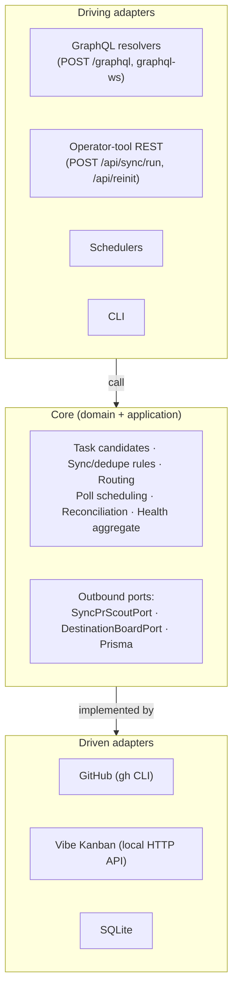

# Architecture

This document captures the key architectural decisions behind vibe-squire. It is intended for contributors and AI agents working on the codebase.

## Hexagonal architecture (ports & adapters)

Core domain logic has no dependency on NestJS, SQLite, GitHub, or Vibe Kanban. Adapters implement port interfaces; NestJS modules wire them together via DI.

**Rule:** Domain and application layers import interfaces, never concrete adapter types.

## Key port interfaces

| Port | Token | Purpose |
|------|-------|---------|
| `SyncPrScoutPort` | `SYNC_PR_SCOUT_PORT` | Poll a source for PR candidates |
| `DestinationBoardPort` | `DESTINATION_BOARD_PORT` | List/create/update issues on a board |
| `SourceStatusPort` | `SOURCE_STATUS_PORT` | Source health for status API and sync guards |
| `DestinationStatusPort` | `DESTINATION_STATUS_PORT` | Destination setup + health checks |

Tokens are defined in `src/ports/injection-tokens.ts`. Adapters are registered by `IntegrationsModule.register(env)` based on `VIBE_SQUIRE_SOURCE_TYPE` / `VIBE_SQUIRE_DESTINATION_TYPE` at boot time.

## Module graph

```mermaid
graph TD
    App["AppModule.forRoot(env)"]

    App --> Env["EnvModule — typed AppEnv via DI"]
    App --> Logger["LoggerModule — Pino"]
    App --> Events["EventEmitterModule — domain events"]
    App --> StatusEvents["StatusEventsModule — PubSub feed for graphql-ws"]
    App --> Prisma["PrismaModule — database client"]
    App --> SyncState["SyncRunStateModule — in-memory sync lock"]
    App --> Settings["SettingsModule — key-value settings"]
    App --> Integrations["IntegrationsModule.register()"]
    App --> Sync["SyncModule — scheduler, dispatcher, reconciliation"]
    App --> Reinit["ReinitModule — POST /api/reinit operator tool"]
    App --> Mappings["MappingsModule — repo → project CRUD (GraphQL)"]
    App --> Status["StatusModule — aggregate health service (GraphQL)"]
    App --> Setup["SetupModule — setup-complete gate"]
    App --> UI["UiModule — operator BFF presenters & nav (GraphQL)"]
    App --> GraphQLMod["OperatorGraphQLModule — schema + resolvers"]

    Integrations --> GH["GithubSourceModule — gh CLI scout"]
    Integrations --> VK["VibeKanbanDestinationModule — HTTP client"]
```

## Configuration precedence

For each tunable key, the effective value is resolved in order:

1. **Environment variable** (if set and non-empty)
2. **SQLite `Setting` row** (user-edited via UI or API)
3. **Code default** (compiled-in)

Boot-time env (`AppEnv`) is validated by Zod in `src/config/env-schema.ts` and injected via `EnvModule`. Runtime settings are managed by `SettingsService` which reads `VIBE_SQUIRE_*` env overrides and the `Setting` table.

## Data model (Prisma / SQLite)

| Model | Purpose |
|-------|---------|
| `Setting` | Key-value runtime settings |
| `RepoProjectMapping` | GitHub `owner/repo` → Vibe Kanban repo UUID |
| `ScoutState` | Per-scout scheduling, last poll, backoff streak |
| `PollRun` | Audit log of each sync cycle |
| `PollRunItem` | Per-PR outcome within a poll run |
| `SyncedPullRequest` | Tracks Kanban issues created for PRs (dedupe + reconciliation) |

Migrations run automatically on every startup before the HTTP server accepts traffic. At runtime, migrations are applied via a lightweight `better-sqlite3` runner (`src/database/sqlite-migrate.ts`) that reads `prisma/migrations/*/migration.sql` files directly — the Prisma CLI is not required. The runner writes to Prisma's `_prisma_migrations` table so both tools stay compatible for local development.

## Sync pipeline

1. **Guard** — check setup is complete, `gh` is authenticated, the destination board probe succeeds.
2. **Scout** — `gh pr list --search "review-requested:@me"` returns PR candidates.
3. **Route** — resolve each PR's `owner/repo` to a Kanban project via `RepoProjectMapping`. Unmapped repos are skipped (logged).
4. **Dedupe** — check `SyncedPullRequest` table; skip PRs already tracked.
5. **Board cap** — enforce `max_board_pr_count` against live issue count on the board.
6. **Create** — call `DestinationBoardPort.createIssue()` for new PRs; record in `SyncedPullRequest`.
7. **Reconcile** — PRs that left the review queue: close their Kanban issues.

## Integration pattern (adding a new source or destination)

1. Define a module under `src/integrations/<name>/`.
2. Implement the relevant port interface (`SyncPrScoutPort` for sources, `DestinationBoardPort` for destinations).
3. Add the type string to `SUPPORTED_SOURCE_TYPES` or `SUPPORTED_DESTINATION_TYPES` in `src/config/integration-types.ts`.
4. Register the module in `IntegrationsModule.register()`.
5. The rest of the pipeline (sync, status, UI) works through port abstractions.

## Vibe Kanban HTTP connection

vibe-squire calls the **local Vibe Kanban HTTP API** (same process as the desktop app). Base URL is resolved from `VIBE_SQUIRE_VK_*` env vars, legacy `MCP_HOST` / `MCP_PORT` aliases, or the desktop `vibe-kanban.port` file under the OS temp directory.

Product docs: [vibekanban.com/docs](https://vibekanban.com/docs).

## Security

- HTTP binds to `127.0.0.1` by default — no public exposure.
- Operator endpoints (`/api/sync/run`, `/api/reinit`) assume localhost trust.
- Credentials live in `gh auth` and env vars; never committed.
- GraphQL status payloads redact secrets.

## Transport decision table

GraphQL is the sole operator-console transport:
- `POST /graphql` for queries and mutations.
- `graphql-ws` subscriptions for live events.

Only two REST endpoints remain as operator tools (`curl` / shell ergonomics): `POST /api/sync/run` and `POST /api/reinit`.

| HTTP | Path | Status | Justification |
|------|------|--------|---------------|
| GET | `/api/activity/runs` | `removed` | Superseded by GraphQL `activityFeed`. |
| GET | `/api/mappings` | `removed` | Superseded by GraphQL `mappings`. |
| POST | `/api/mappings` | `removed` | Superseded by GraphQL `upsertMapping`. |
| PATCH | `/api/mappings/:id` | `removed` | Superseded by GraphQL `updateMapping`. |
| DELETE | `/api/mappings/:id` | `removed` | Superseded by GraphQL `deleteMapping`. |
| POST | `/api/pr/accept` | `removed` | Superseded by GraphQL `acceptTriage`. |
| POST | `/api/pr/decline` | `removed` | Superseded by GraphQL `declineTriage`. |
| POST | `/api/pr/reconsider` | `removed` | Superseded by GraphQL `reconsiderTriage`. |
| POST | `/api/reinit` | `kept (operator tool)` | Convenient `curl` trigger for local source/destination re-bootstrap. |
| GET | `/api/settings` | `removed` | Superseded by GraphQL `effectiveSettings`. |
| PATCH | `/api/settings/core` | `removed` | Superseded by GraphQL `updateSettings`. |
| PATCH | `/api/settings/destination` | `removed` | Superseded by GraphQL `updateDestinationSettings`. |
| PATCH | `/api/settings/source` | `removed` | Superseded by GraphQL `updateSourceSettings`. |
| GET | `/api/status` | `removed` | Superseded by GraphQL `status`. |
| GET | `/api/status/stream` | `removed` | Superseded by GraphQL `statusUpdated`. |
| POST | `/api/sync/run` | `kept (operator tool)` | Convenient `curl` and shell trigger for manual sync. |
| GET | `/api/ui/github-fields` | `removed` | Superseded by GraphQL `githubFields`. |
| GET | `/api/ui/nav` | `removed` | Superseded by GraphQL `integrationNav`. |
| GET | `/api/ui/settings-meta` | `removed` | Superseded by GraphQL `effectiveSettings`. |
| GET | `/api/ui/setup` | `removed` | Superseded by GraphQL `dashboardSetup`. |
| GET | `/api/vibe-kanban/organizations` | `removed` | Superseded by GraphQL `vibeKanbanOrganizations`. |
| GET | `/api/vibe-kanban/projects` | `removed` | Superseded by GraphQL `vibeKanbanProjects`. |
| GET | `/api/vibe-kanban/repos` | `removed` | Superseded by GraphQL `vibeKanbanRepos`. |
| GET | `/api/vibe-kanban/ui-state` | `removed` | Superseded by GraphQL `vibeKanbanUiState`. |
